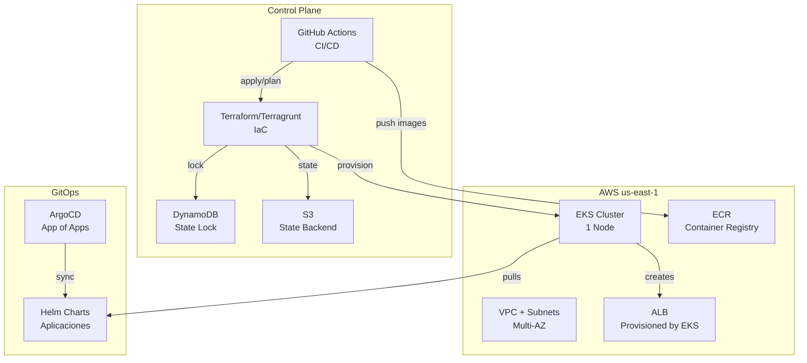

# DevOps Lab: AWS EKS + ArgoCD + Terraform + FinOps


**⚠️ ADVERTENCIA DE COSTOS**: A pesar del tier free, EKS puede incurrir en costos (~$0.10/hora). Ejecuta `infracost breakdown` ANTES de `terraform apply`. Destruye con `./cleanup.sh` después de pruebas.

## 📊 Arquitectura



## 🛠️ Tecnologías & Por Qué

| Tecnología | Propósito | Beneficio |
|---|---|---|
| **Terraform + Terragrunt** | IaC | DRY, versionado, repeatabilidad |
| **GitHub Actions** | CI/CD | Native, sin costo, integración GitHub |
| **Docker Multi-stage** | Seguridad | Imágenes 90% más pequeñas, <base>-final |
| **ArgoCD (App of Apps)** | GitOps | Sync automático, rollback, auditoría |
| **InfraCost** | FinOps | Costos ANTES de apply, por recurso/hora |
| **DynamoDB Lock** | Concurrencia | Previene race conditions en CI/CD |
| **AWS Audit** | Compliance | Detecta drift, recursos huérfanos, LBs automáticos |

## 💰 Estimado de Costos (free tier máx)

```
┌─────────────────────────────────────────┐
│ Recurso               │ $/hora  │ $/mes  │
├─────────────────────────────────────────┤
│ EKS (master)          │ $0.10   │ $73    │
│ EC2 t3.micro (1x)     │ $0.01   │ $7     │
│ NAT Gateway           │ $0.03   │ $22    │
│ ALB (hours + LCU)      │ $0.02   │ $15    │
│ DynamoDB (on-demand)  │ $0.00   │ $0.50  │
│ S3 (storage)          │ $0.00   │ $0.23  │
├─────────────────────────────────────────┤
│ TOTAL ESTIMADO        │ $0.16   │ $117   │
└─────────────────────────────────────────┘
```

**Nota**: InfraCost mostrará valores exactos. Valores arriba son aproximados.

## 📦 Contenido

```
.
├── README.md                          # Este archivo
├── runbook.md                         # Guía paso-a-paso ejecutable
├── terraform/
│   ├── terragrunt.hcl                # Config global
│   ├── backend-config.hcl            # Backend remoto DynamoDB+S3
│   ├── environments/
│   │   └── dev/
│   │       ├── terragrunt.hcl
│   │       ├── vpc.tf
│   │       ├── eks.tf
│   │       ├── ecr.tf
│   │       └── variables.tf
│   └── modules/
│       ├── vpc/
│       ├── eks/
│       ├── ecr/
│       └── security/
├── docker/
│   ├── app/Dockerfile                # Multi-stage
│   └── nginx/Dockerfile              # Reverse proxy
├── k8s/
│   ├── argocd-app-of-apps.yaml      # AppProject + ApplicationSet
│   └── apps/
│       ├── nginx-deploy/
│       └── monitoring/
├── github/
│   └── workflows/
│       ├── terraform.yml             # Plan, lint, infracost
│       ├── app.yml                   # Build, test, push ECR
│       └── deploy.yml                # ArgoCD sync
├── scripts/
│   ├── backend-setup.sh              # Crear backend remoto
│   ├── backend-list.sh               # Listar estados
│   ├── backend-cleanup.sh            # Eliminar backend
│   ├── audit.py                      # Detecta drift + huérfanos
│   ├── cleanup.sh                    # Destroy con orden inverso
│   └── validate-no-drift.sh          # Fail si hay cambios
└── docs/
    ├── ARCHITECTURE.md
    ├── COST_ANALYSIS.md
    └── TROUBLESHOOTING.md
```

## 🚀 Inicio Rápido

```bash
# 1. Clonar repo y configurar credenciales AWS
git clone <repo>
cd devops-lab
export AWS_PROFILE=default  # Ajustar según tu configuración

# 2. Crear backend remoto
./scripts/backend-setup.sh

# 3. Ver costos estimados
cd terraform/environments/dev && terragrunt run-all init && \
  terragrunt run-all plan && \
  terragrunt run-all fmt -check && \
  infracost breakdown --path . --format table

# 4. Aplicar infraestructura
terragrunt run-all apply -auto-approve

# 5. Validar sin drift
./scripts/audit.py

# 6. Agregar app en ArgoCD (plug-and-play)
kubectl apply -f k8s/argocd-app-of-apps.yaml

# 7. Limpiar todo
./cleanup.sh
```

## ✅ Validaciones Incluidas

- ✓ Terraform fmt, validate, tflint
- ✓ Security scan (checkov, trivy)
- ✓ Docker multi-stage + scan
- ✓ DynamoDB state locking
- ✓ InfraCost breakdown (por hora y mes)
- ✓ Audit: drift detection + recursos huérfanos
- ✓ Load Balancer automático por EKS (detecta y elimina)
- ✓ Cleanup: orden inverso + esperas activas + reintentos
- ✓ GitHub Actions: lint, security, build, test, deploy

## 📖 Documentación

- **[runbook.md](runbook.md)**: Pasos exactos, comandos, validaciones, troubleshooting
- **[ARCHITECTURE.md](docs/ARCHITECTURE.md)**: Decisiones de diseño, seguridad, HA
- **[COST_ANALYSIS.md](docs/COST_ANALYSIS.md)**: Desglose por servicio, optimizaciones
- **[TROUBLESHOOTING.md](docs/TROUBLESHOOTING.md)**: Problemas comunes y soluciones

## 🔐 Seguridad

- Terraform state cifrado (S3 SSE + DynamoDB encryption)
- ECR image scan (push + pull)
- Docker multi-stage (reduces attack surface)
- SecurityGroup restringido por IP/puerto
- IAM roles least privilege
- No secrets en código (usar Secrets Manager/GitHub Secrets)

## 🤝 Contribuir

1. Fork el repo
2. Crea rama `feature/xxx`
3. Commit con mensaje descriptivo
4. Push y abre PR
5. CI/CD valida automáticamente

## 📝 License

MIT License - Ver LICENSE.txt

---

**Versión**: 1.0.0  
**Última actualización**: 2026-04-28  
**Autor**: DevOps Lab Team
